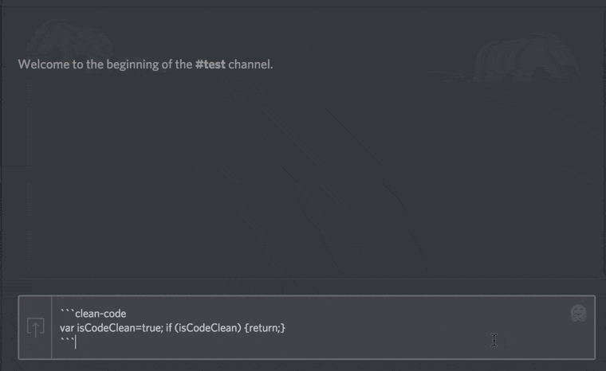

# JS Beautify Discord Bot
A Discord bot that cleans up your javascript! It automatically detects when a code block with the language `clean-code` is used, and replaces it with a message containing that code run through [js-beautify](http://jsbeautifier.org/). See it in action:



## Installation
To get started:
```
git clone https://github.com/christopherwk210/JS-Beautify-Discord-Bot.git
npm i
npm start
```
You will also need to create an `auth.json` file that contains your bot token. See `auth.example.json` for how to format that file.

If you want to change the js-beautify options, simply modify `jsbeautify.json`. Visit [jsbeautifier.org](http://jsbeautifier.org/) for more info.

## Usage
Once the bot is set up on your server, simply format your code blocks like so in your messages:

    ```clean-code
    // insert dirty code here
    ```

And the bot will automatically intercept your response with nicely formatted code! If you have any content outside the code blocks it will be included in the response unaffected.
